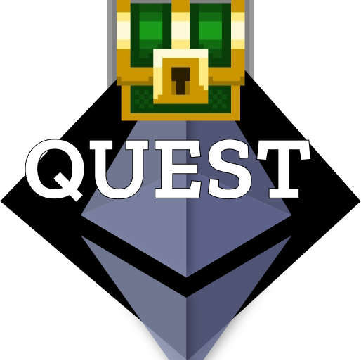

<h1 align="center">ETHQuest</h1>

    

  <h6>Built at ETHGlobal HackFS'22</h6>
  

  

  
View the project demo on <a href="https://youtu.be/lUCj6xQJxkk">YouTube</a>

ETHQuest is an RPG NFT dungeon game, built on **Ethereum & Polygon** built on Phaser Game Engine, and powered by **ChainlinkVRF, NFT.Storage, IPFS & Filecoin, Covalent APIs.**

- The game's main aim is to level up by collecting as many loot boxes (chests), in ERC-20 $DGN tokens, as a reward, by killing all the demons and monsters guarding the chests.

- The player has three lives. Every enemy has different hit points depending upon the type (ghost, Stone Yeti, Knight, Zombie, and many more). The player has to wield knives against the enemy and pass the levels as the story proceeds. Each level is based on different storylines.

- Collecting every chest mint 4 $DGN Dungeon Tokens as a reward from the reward contract. 
There are also keys locked at different avenues inside the game, which the player needs to look out for in order to unlock the token gates. The player is also faced with killing the ultimate evil angel who possesses the final key to the ETHGlobal NFT.
Upon collecting the NFT, the user is minted NFTs with Random attributes, powered by **Chainlink VRFs** that decide traits like Rarity, and Worth, depending on the level of the game. These are seen in the trophy cabinet.

- Players can also track their rewards in-game in the analytics dashboard that is powered by **Covalent APIs**, that index blockchain data, using a unified API service for multiple chains. In our case, we have used the ERC-20 tracking API to track the address(from) and the address(to) to which the token gets minted in the game, along with the timestamps and the transaction hash. 

- The game has a free space for creators to innovate the game with NFT assets like game sprite sheets and game map designs, that would be reviewed by the community of players and rewarded in ETH tokens for their work. We use Protocol Labs's **NFT.Storage** service to store the NFT metadata like images, and descriptions of the NFT to the **IPFS** in a permanent and verifiable manner on the decentralized network. The hash obtained as { ipnft } in the json object, is fed as the image hash to the smart contract, thus facilitating data storage off-chain mapped to the smart contract. 

- Thus it is a fun project to play, own and earn in the gaming metaverse, where even the creators or makers of the game are rewarded and the game would pivot its development with the voice of the community supporting it. 

# Architecture

# Smart Contract & web3
1. `TrophyChar.sol` - Chainlink VRF
2. `DungeonToken.sol` - $DGN reward token
3. `Creator.sol` - ETHQuest Creator Space
4. `NFT Storage` [Implemetation](https://github.com/lopeselio/hackfs22-ETHQuest/blob/master/blockchain/src/components/main.js#L110)
5. `Covalent` [API Call](https://github.com/lopeselio/hackfs22-ETHQuest/blob/master/blockchain/src/components/covalent.js#L5)

# Plans for the future
- Token gated chat using Covalent APIs and Lit protocol, and XMTP network to alert users of new collections, airdrops, and updates for certain NFT holders.
- To have an in-game DEX, to allow users to swap other tokens on ETHEREUM to DGN token
- In game marketplace to allow users to buy and sell NFT characters and game potions and equip the same in further levels.
- 1v1 gameplay between two warriors by staking tokens and fighting for the stake
- Ability to craft Rare NFTs, by on-chain XP, that is attained while playing the levels.
- Genesis NFT minting event through a mystery box sale, based on character rarity.
- A creator DAO, powered by community, in which curated artwork is reveiwed and artists are rewarded to contribute unqiue game-assets to the game, thus facilitating recruitments and opportunities within the game economy.
- To index NFT data on the game dashboard and provide powerful on-chain insights using Covalent.

# Tools and Tech Stack

- The game is built on Phaser.
- The app is built in React
- We deploy our contracts to Ethereum Rinkeby and Polygon Mumbai TestNet.
- Web3 JS is used to interact with the smart contract ABI while emitting in-game events.
- chainlink's VRF is used to generate random numbers for provably verified NFTs as game rewards after finishing a level
- NFT.Storage is used to store NFT metadata off-chain for NFTs minted in the creator's space.
- Covalent APIs are used to index Blockchain data and provide insights from on-chain, using data indexed from the blockchain, we track, $DGN rewards using Covalent APIs on the players game analytics dashboard
- Smart Contracts are built on Solidity, deployed and tested using Truffle

Contract Addresses:
- Token Address Dungeon Token $DGN on Ethereum Rinkeby TestNet: `ADDRESS` View here: [Etherescan Explorer]()

# GamePlay Screenshots

# Creator's Feed

# Trophy Cabinet 

# User Dashboard

